# MSc IoT & Big Data – First Assignment

# OYELEKE'S PART

This repository contains my analysis of 7 days of sensor data (5-second interval) for **temperature**, **humidity**, and **light**.

The main analysis script is:

- [`iot_analysis_first_assignment.py`](iot_analysis_first_assignment.py)

All generated outputs (CSVs, plots, text report) are stored under:

- [`outputs/`](outputs/)
  - [`outputs/plots/`](outputs/plots/) – all figures
  - `iot_descriptive_stats.csv`
  - `iot_hourly_stats.csv`
  - `iot_daily_peak_hours.csv`
  - `iot_daily_summary.csv`
  - `iot_enriched_features_and_anomalies.csv`
  - `iot_story_report.txt`

---

## Task 1.1 – Time-series plots and correlation

### 1.1.1 Time-series with night shading

- Temperature over time  
  

- Humidity over time  
  

- Light intensity over time  
  

### 1.1.2 Temperature & Humidity relationship

- Simple scatter plot  
  

- Scatter + interpretation proof  
  

- Full-week dual time-series (temperature & humidity)  
  

### 1.1.3 Correlation heatmap

- Correlation between temperature, humidity, and light  
  

### Findings & Interpretation – Task 1.1

The time-series plots show that temperature and humidity remain within narrow ranges throughout the week, which suggests a **controlled indoor environment**. Temperature stays roughly between 22–24°C, while humidity stays around 48–52%, without clear warming or cooling trends.

Light intensity remains in the range of a few hundred lux and never approaches levels typical of direct sunlight (often above 20,000 lux). This indicates that illumination is dominated by **artificial indoor lighting**, not natural day–night cycles. Occasional peaks are more likely reflections or brief changes in indoor usage rather than real sunlight.

The scatter plots of temperature vs humidity look random, with no visible pattern. The correlation heatmap confirms that temperature, humidity, and light have **no meaningful linear relationship** in this dataset. In other words, humidity does not affect temperature, and temperature does not affect humidity in this setting. This is consistent with separate, regulated controls (e.g. HVAC) and a stable indoor space.

Overall, Task 1.1 shows a highly stable environment with independent sensor behaviour and no strong natural environmental transitions.

---

## Task 1.2 – Day vs Night comparisons

Day/night labels are based on time (06:00–18:00 = day, otherwise night).

- Temperature – Day vs Night  
  

- Humidity – Day vs Night  
  

### Findings & Interpretation – Task 1.2

The day–night separation is done by clock time, but the light readings show that illumination is artificial and remains relatively constant. This means that the “day vs night” labels do not represent true exposure to sunlight.

The boxplots for temperature and humidity show nearly identical distributions for both day and night. There is no noticeable cooling at night or heating during the day. This supports the conclusion that the environment is **fully controlled**, with indoor HVAC and artificial lighting maintaining consistent conditions, regardless of the time of day.

---

## Task 1.3 – Descriptive and hourly statistics

Descriptive statistics of all sensors are saved in:

- [`outputs/iot_descriptive_stats.csv`](outputs/iot_descriptive_stats.csv)

Hourly mean/min/max statistics are saved in:

- [`outputs/iot_hourly_stats.csv`](outputs/iot_hourly_stats.csv)

### 1.3.1 Per-sensor hourly mean/min/max

- Temperature – hourly mean / min / max  
  

- Humidity – hourly mean / min / max  
  

- Light – hourly mean / min / max  
  

### 1.3.2 Combined hourly view

- Temperature, Humidity, Light – hourly mean/min/max in one figure  
  

### Findings & Interpretation – Task 1.3

Aggregating the 5-second sensor readings into hourly mean, minimum, and maximum values helps reduce noise and highlight broader patterns. The hourly plots show that temperature and humidity vary only slightly from hour to hour, which confirms that the environment is kept within tight limits.

Light intensity shows modest fluctuations but remains within a range consistent with artificial lighting. There is no sharp spike pattern that would correspond to sunrise or sunset.

The combined hourly plot clearly illustrates that none of the sensors exhibit strong daily rhythms. The system behaves as a **steady, controlled indoor space**, which is ideal for repeatable monitoring or experimentation.

---

## Task 1.4 – Daily peak hours (hottest / most humid / brightest hour)

Daily peak hours (based on hourly means) are stored in:

- [`outputs/iot_daily_peak_hours.csv`](outputs/iot_daily_peak_hours.csv)

### 1.4.1 Summary bar plots (per day)

- Hottest hour of each day (temperature)  
  

- Most humid hour of each day (humidity)  
  

- Brightest hour of each day (light)  
  

### 1.4.2 Hour-of-day vs true hourly max, per variable and per day

#### Temperature – hourly maxima by day

- 2025-03-01  
  
- 2025-03-02  
  
- 2025-03-03  
  
- 2025-03-04  
  
- 2025-03-05  
  
- 2025-03-06  
  
- 2025-03-07  
  

- All days combined  
  

#### Humidity – hourly maxima by day

- 2025-03-01  
  
- 2025-03-02  
  
- 2025-03-03  
  
- 2025-03-04  
  
- 2025-03-05  
  
- 2025-03-06  
  
- 2025-03-07  
  

- All days combined  
  

#### Light – hourly maxima by day

- 2025-03-01  
  
- 2025-03-02  
  
- 2025-03-03  
  
- 2025-03-04  
  
- 2025-03-05  
  
- 2025-03-06  
  
- 2025-03-07  
  

- All days combined  
  

### Findings & Interpretation – Task 1.4

Daily peak analysis shows that the hottest, most humid, and brightest hours move slightly from day to day, but always within a narrow range. These small shifts are typical of indoor environments where conditions are generally stable but can vary a bit due to normal usage, HVAC cycling, or sensor noise.

The light peaks are clearly not driven by sunrise or sunset. Their magnitudes and timings are more consistent with artificial lighting schedules and occasional reflections or activity-related changes.

Temperature and humidity peaks do not indicate any extreme events. They remain within comfortable, controlled ranges, confirming that the space is stable with minor fluctuations linked to everyday indoor behaviour rather than external weather.

---

## Task 1.5 – Daily mean temperature, humidity, and light

Daily mean values and the hottest/most humid/brightest day are stored in:

- [`outputs/iot_daily_summary.csv`](outputs/iot_daily_summary.csv)

Plots of daily means:

- Daily mean temperature  
  

- Daily mean humidity  
  

- Daily mean light intensity  
  

### Findings & Interpretation – Task 1.5

Daily averages remain very consistent across the week. The differences between the hottest, most humid, and brightest days are small and well within what is expected for a controlled room.

This confirms three main points:

1. The sensor data is reliable over the entire week.  
2. The environment is **stable**, with no large day-to-day shifts.  
3. Any small differences in daily means are due to normal indoor usage rather than external conditions.

---

## Task 2 – Feature engineering & anomaly detection

### 2.1 Moving average (10-min) and rate of change (ROC)

Weekly overview:

- Temperature – MA & time-series (whole week)  
  

- Temperature – ROC (whole week)  
  

- Humidity – MA (whole week)  
  

- Humidity – ROC (whole week)  
  

### Per-day MA plots (temperature)

- 2025-03-01  
  
- 2025-03-02  
  
- 2025-03-03  
  
- 2025-03-04  
  
- 2025-03-05  
  
- 2025-03-06  
  
- 2025-03-07  
  

### Per-day ROC plots (temperature)

- 2025-03-01  
  
- 2025-03-02  
  
- 2025-03-03  
  
- 2025-03-04  
  
- 2025-03-05  
  
- 2025-03-06  
  
- 2025-03-07  
  

### Per-day MA plots (humidity)

- 2025-03-01  
  
- 2025-03-03  
  
- 2025-03-04  
  
- 2025-03-05  
  
- 2025-03-06  
  
- 2025-03-07  
  

### Per-day ROC plots (humidity)

- 2025-03-01  
  
- 2025-03-02  
  
- 2025-03-03  
  
- 2025-03-04  
  
- 2025-03-05  
  
- 2025-03-06  
  
- 2025-03-07  
  

### Findings & Interpretation – Task 2.1 (Moving Average & Rate of Change)

The 10-minute moving average smooths the raw 5-second readings and reveals the underlying trend of each sensor. Temperature and humidity moving averages remain almost flat with small oscillations, which confirms long-term stability in the environment and supports the idea of a controlled indoor space.

The weekly MA plots show no gradual warming or cooling over the week. The day-by-day MA plots also look similar, meaning each day behaves almost the same as the previous one. Light moving averages stay in the expected range for artificial lighting, reinforcing that illumination is not driven by natural daylight.

The rate-of-change (ROC) plots show frequent small spikes in both directions. These spikes arise mainly from high-frequency noise and very short-term disturbances. ROC values fluctuate around zero, which indicates that there are no extended periods of continuous warming, cooling, humidifying, or drying.

Taken together, the MA and ROC analysis demonstrates that:
- the environment is stable over both short and long time scales,  
- most of the “movement” in the ROC is noise at 5-second resolution, and  
- each day’s behaviour closely matches the others.

---

### 2.2 Anomaly detection (±3σ, 10-minute rolling window)

Anomalies are detected using a 3σ rule on a 10-minute rolling mean and standard deviation.

- Temperature anomalies  
  

- Humidity anomalies  
  

- Light anomalies  
  

### Findings & Interpretation – Task 2.2

The ±3σ anomaly detection flags isolated spikes that deviate from the rolling mean. These anomalies are short-lived and do not form long continuous segments. They most likely represent momentary sensor noise, quick activity near the sensors, or short disturbances such as doors opening or lights being switched.

Because the overall moving averages stay steady and anomalies do not persist, the environment remains consistent and well regulated. The anomaly detection mainly highlights brief, localised events rather than any major change in the underlying conditions.

# MISIKIR'S PART

# Summary of plots

## First day (2025-03-01)

### Patterns and trends

 
[1.1 humidity average](outputs/plots/1.1_Minute_average_humidty_versus_time.png)
[1.1 light average](outputs/plots/1.1_minute_average_light_versus_time.png)

Since the variation of sensor readings is changed every 5 seconds, it is difficult to understand and plot the trend of temperature, humidity and light intensity over time within that frequency. So, I have decided to plot and understand the minute average values of sensor readings to decrease the frequency of variations. According to the above plot the maximum average minute temperature was 23.8 ℃ recorded at 16:20:00 and the minimum minute average temperature was approximately 20.2 ℃ at 18:36:00. However, the maximum temperature throughout the day is 25 ℃ recorded at 00:36:00 and the minimum value of temperature was 20 ℃ at 00:14:25, which means both the maximum and minimum temperatures are recorded at midnight. In addition to this the maximum and minimum minute average humidity are recorded at 21:31:00 and 22:50:00 respectively. Furthermore, the maximum and minimum minute average light intensity values were also recorded at 07:59:00 and 08:11:00 respectively. Generally, the above graph tells us there is a huge fluctuation of temperature, humidity and light intensity readings over time which may be caused by external factors such as artificial light, sensor fault or dynamic weather environmental conditions.

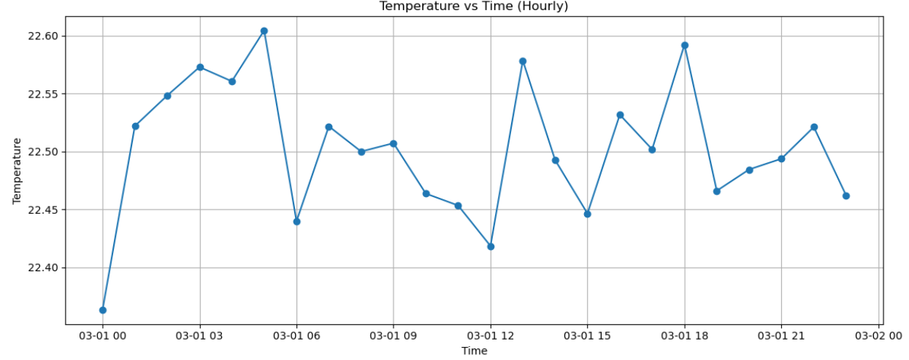

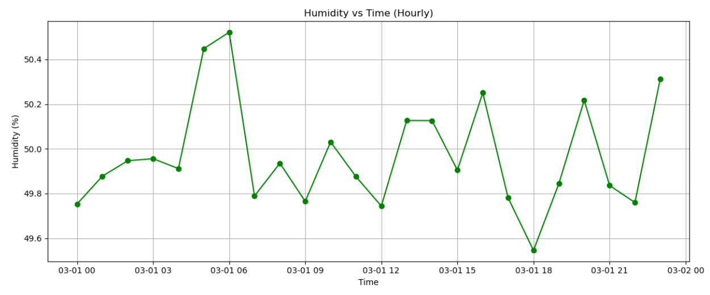

According to the hourly average values of sensor readings the maximum temperature value was recorded at 05:00 and the minimum value was recorded at 00:00. In case of humidity the maximum value was recorded at 06:00 and the minimum value was recorded at 18:00. Light intensity was also maximum at 11:00 and minimum at 10:00.

### Correlation

These results confirm the independence of temperature, humidity, and light in the monitored environment over the measured period.

None of the sensor readings are strongly influenced or linearly dependent on the others, suggesting either the environment is well-regulated or external factors do not meaningfully co-vary.

### Relationship between temperature and humidity

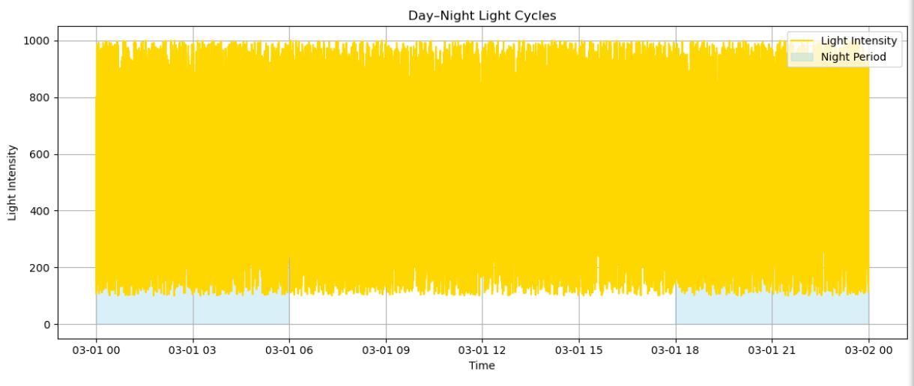
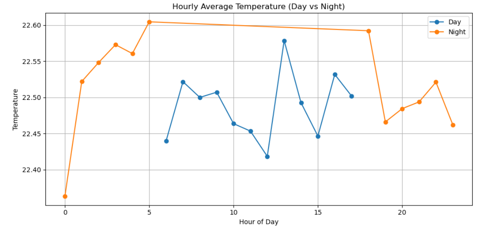
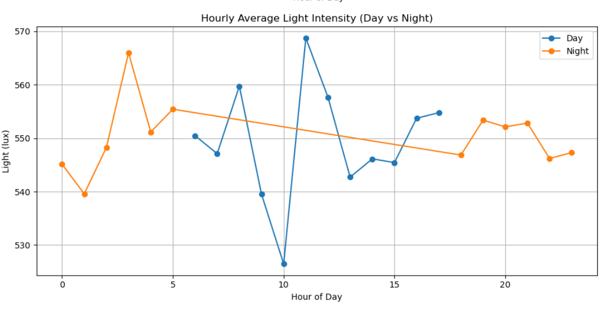
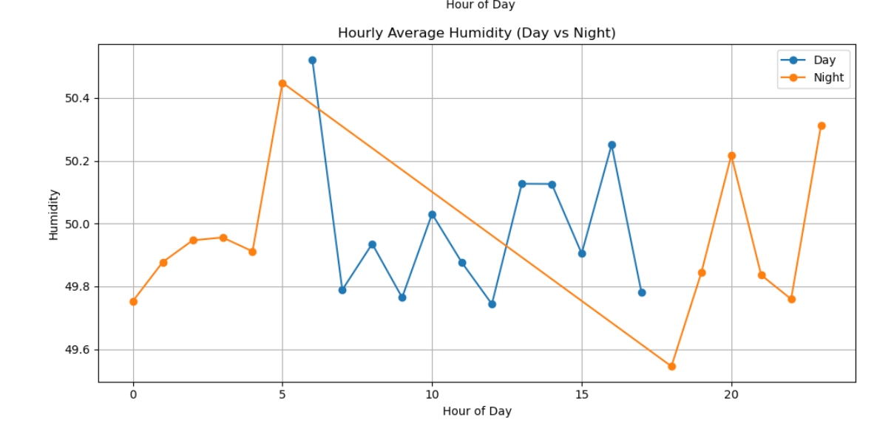

In practical terms, this plot demonstrates that within the measured range, temperature fluctuations did not cause humidity to rise or fall, and vice versa. This supports the idea that the environment is well-controlled or that external influences on humidity and temperature act independently.

The plot provides strong visual confirmation of a lack of any statistically significant relationship between temperature and humidity in this dataset. The values fluctuate independently, with no apparent pattern or predictive link between them.

### Min, max, mean and variance values

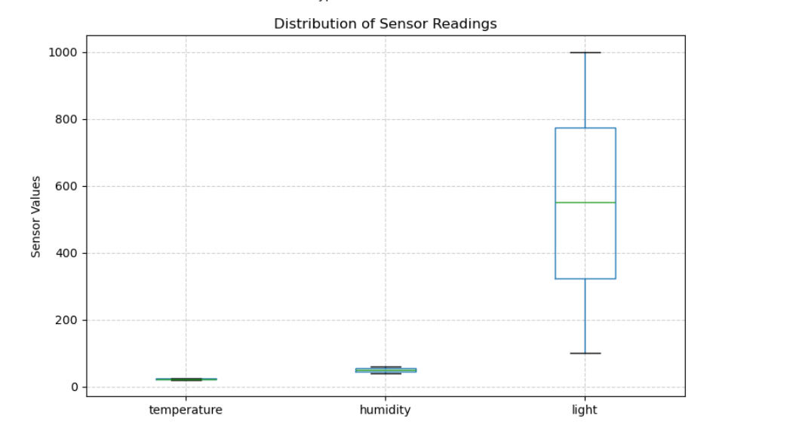
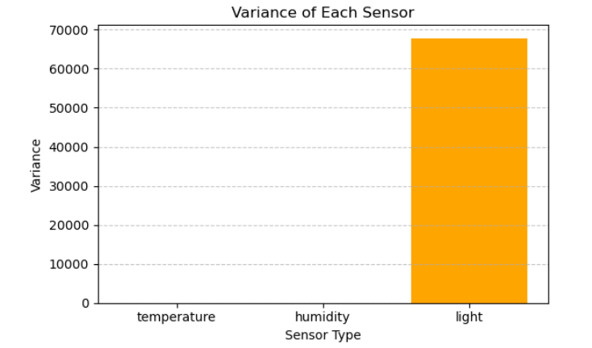
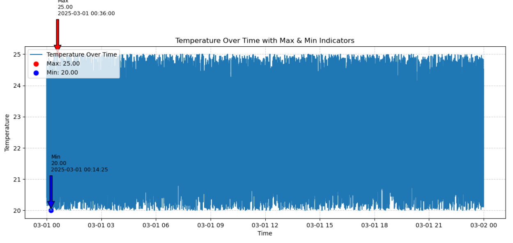

[`outputs/mis_1.csv`](outputs/mis_1.csv)

The maximum light intensity value reached is approximately 999.96 units at 14:09:20 and the minimum value is around 100.04 at 02:25:45.

There is substantial variation in light readings, indicating active changes possibly due to daylight cycles or artificial lighting.

Temperature varies between a minimum of 20.00°C (at 00:14:25) and a maximum of 25.00°C (at 00:36:00), with frequent fluctuations, though always within a limited range. This suggests periodically but regulated changes potentially from climate control systems.

Humidity fluctuates between a minimum of 40.00% (at 00:32:10) and a maximum of 60.00% (at 23:00:10). It shows broad variation through the day, which may reflect changes in environmental conditions, ventilation, or occupancy.

### Anomaly detection and outlier detection

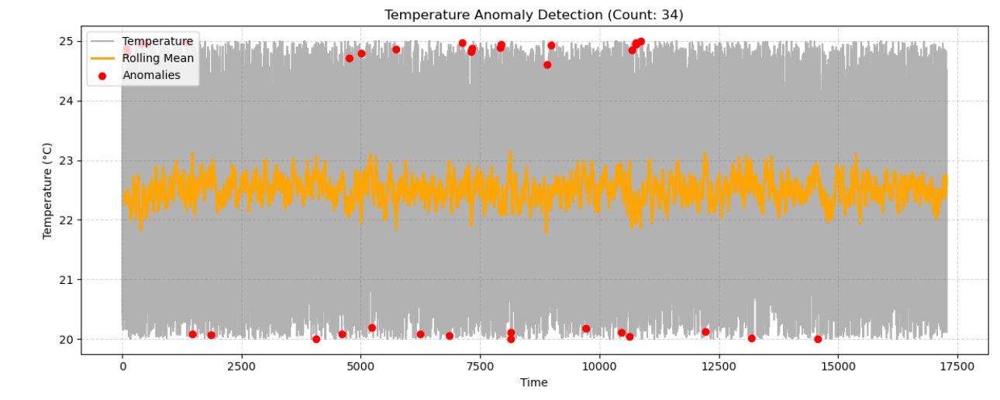
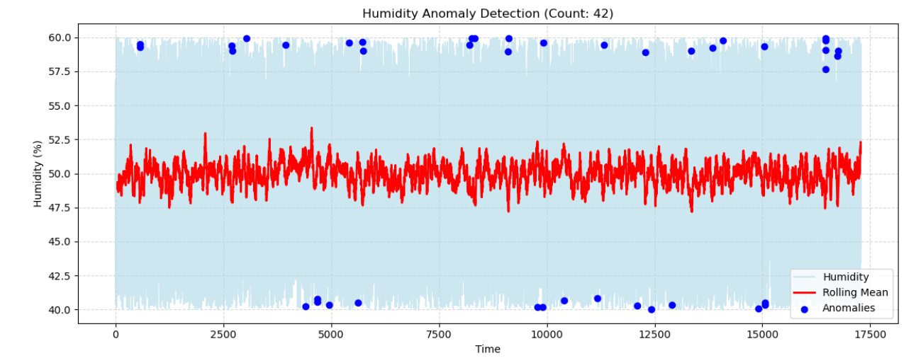
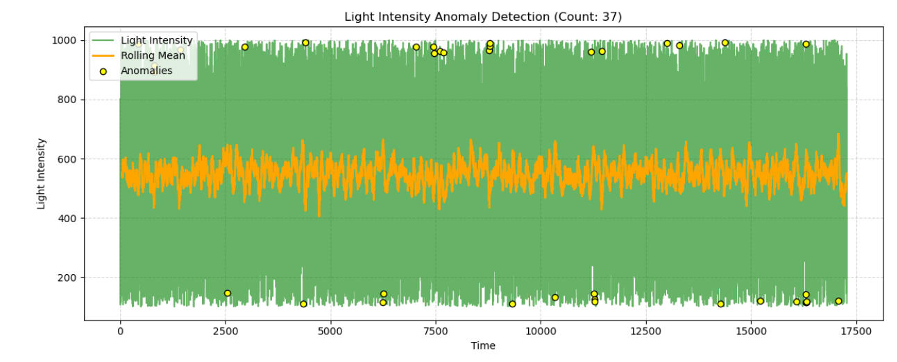

Condition: Flag anomaly if deviation > 2 × std from rolling mean.

There are 42 detected anomalies, indicating periods where humidity deviated significantly from typical levels.

37 anomalies are detected throughout the data, reflecting occasional abnormal spikes or drops in light readings. Most anomalies are at the extremes, close to the highest or lowest values, suggesting sudden changes in lighting conditions.

There are 34 detected anomalies, either sudden drops or spikes in temperature. Most temperature anomalies occur at the boundaries of the typical data range, suggesting quick transitions or possible sensor artifacts.

This visualization is useful to identify trends of frequent abnormal readings that may indicate sensor faults or extreme environmental events. Most anomalies are associated with extreme values (very high or low) that deviate from the normal rolling mean, potentially indicating environmental disruptions, abrupt changes, or sensor faults.

# FEATURES

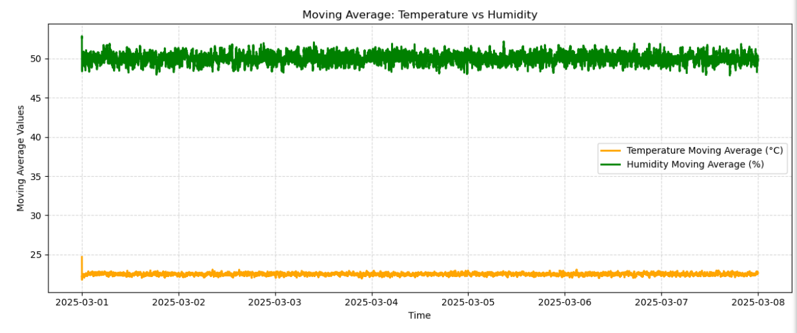

---

# WEEKLY DATASET

Plots to visualize the hourly variations of humidity (%), light intensity, and temperature over a week, from March 1 to March 8, 2025.

Trend and Fluctuations:

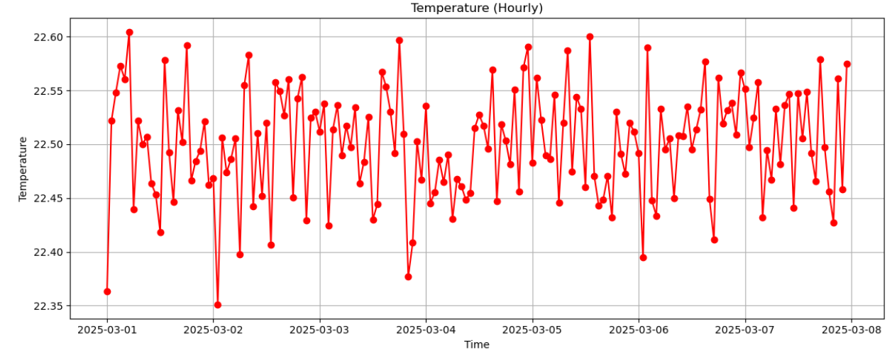

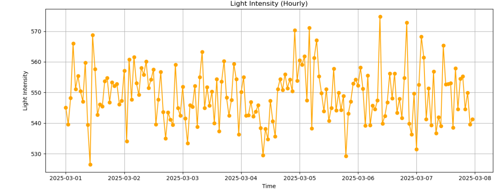

All three variables (humidity, light intensity, temperature) show frequent short-term fluctuations, with values varying considerably from hour to hour. However, despite these fluctuations, none of the variables show a strong long-term upward or downward trend over the week; their average values remain relatively stable.

The hourly average humidity levels mostly oscillate between approximately 49.6% and 50.6%. Even though the variability is noticeable, there are no extreme peaks or persistent drops. This oscillation suggests a balance between environmental factors that add and remove moisture, possibly affected by indoor/outdoor transitions or ventilation cycles. Humidity is moderately variable, reflecting interactions between air, surfaces, and possibly ventilation.

The hourly average light intensity varies between roughly 530 and 570 lux. The fluctuations here might be more pronounced than those in humidity and temperature, possibly reflecting changes in daylight, artificial lighting, or room usage patterns. There is no strong day/night pattern evident, but there are unpredictable peaks and troughs that may align with specific events or periods of increased activity. Light intensity exhibits the widest short-term changes, likely due to external factors (windows, usage patterns) or deliberate light adjustments.

The hourly average temperature values are clustered tightly, ranging from about 22.35°C to 22.60°C. These readings imply a highly regulated thermal environment, typical of an indoor setting with controlled heating or cooling since temperature is most stable, suggesting active regulation. Fluctuations are present, but the overall spread is the narrowest, indicating minimal external influence or variability.

Generally, these plots tell us that in a controlled environment, temperature remains highly stable, humidity experiences moderate natural variation, and light intensity is subject to frequent and sometimes large fluctuations, probably driven by human activity and external conditions.

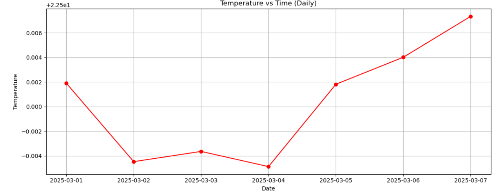

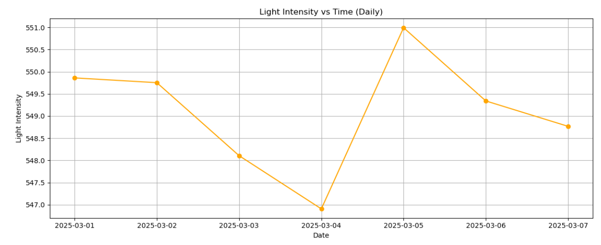

All parameters exhibit small, gradual changes over the week, with no sudden dramatic shifts. Temperature and humidity generally remain stable with minor daily variation, suggesting effective environmental control likely in an indoor or regulated space. However, light intensity has more pronounced daily swings compared to the other parameters, particularly the sharp peak on March 5, possibly due to external events or changes in lighting habits.

According to the daily average plot the hottest day is March 7, 2025, and the coolest day is March 4, 2025.

### Correlation 

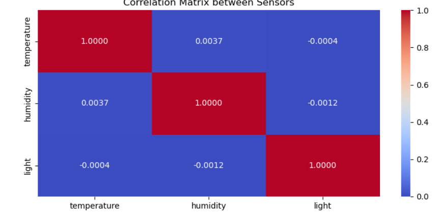

1. **Humidity–Temperature Inverse Relationship Over Time**

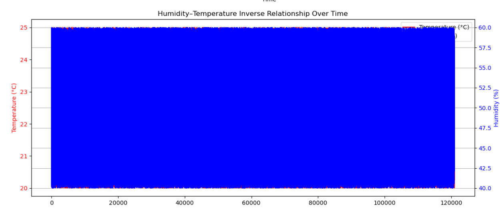
There is no clear visual evidence of a strong inverse (negative) relationship between their trends; they appear largely independent.

2. **Day Night Light Cycles**  

Light intensity is high during daytime and drops in the shaded periods, visually distinguishing between day and night cycles. However, the classification does not clearly show the regular day and night cycle period due to other external factors which affect light intensity.

All three sensors report values that remain inside well-defined, narrow ranges over time. Temperature, humidity, and light intensity do not show strong correlation or mutual influence either visually or mathematically.

### Basic statistics

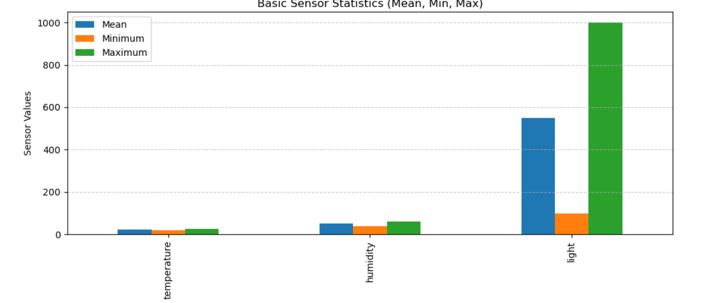

---

# 1.4 Anomalies

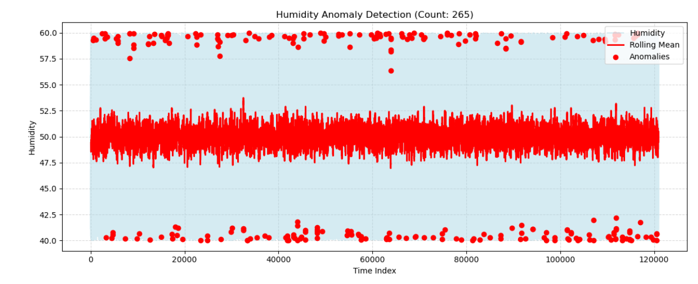

---

# Features

### Moving Average: Temperature vs Humidity

The temperature moving average of a week remains steady around 22°C–23°C, indicating highly stable indoor climate control. Humidity moving average consistently stays near 50%, also showing environmental stability. Both variables display minor short-term fluctuations but no large shifts over the week.

### Rate of Change: Temperature vs Humidity

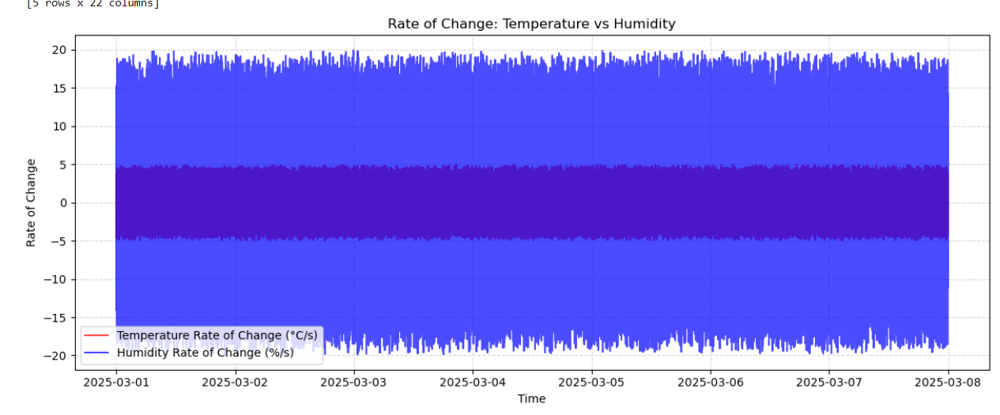

The values oscillate around zero, meaning that at most times, changes are gradual and balanced rather than abrupt. The spread (height of oscillation) indicates some variability, but since the mean rate remains near zero, the environment is not experiencing sustained increasing or decreasing trends.

### Rolling Mean Comparison: Temperature, Humidity, Light

This plot expands the comparison by including light intensity alongside temperature and humidity rolling means. Light intensity’s rolling mean is around 500–600 units, showing more noticeable variation than temperature or humidity.

Temperature and humidity remain stable and nearly flat over time, reinforcing the interpretation of well-controlled indoor conditions.

# BOTH AGREED CONCLUSION
Both analyses independently confirm that the monitored space is a stable, well-regulated indoor environment with narrow variations in temperature, humidity, and light. The sensors operate independently with no linear relationship, and anomalies are brief, noise-driven events rather than meaningful environmental changes. The main difference between both interpretations arises from the level of granularity used: minute-level data suggests more visible fluctuations, while hourly and moving-average views emphasize overall stability.